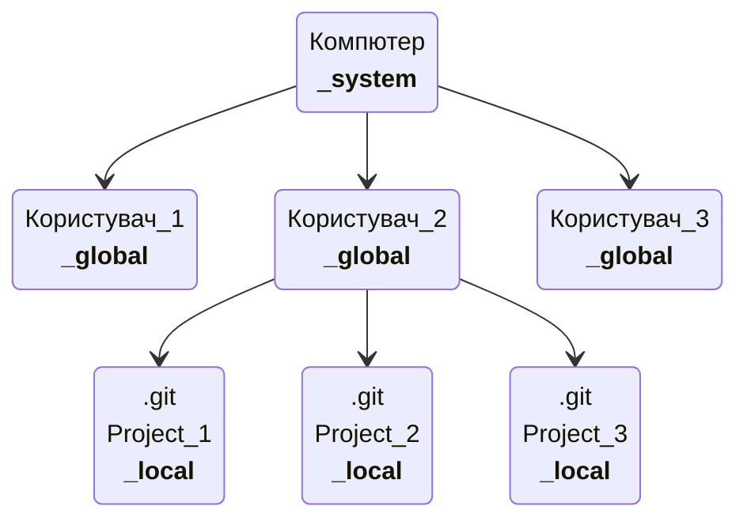

```git
#Налаштування конфігурації git
$ git config user.name '...' '#Ім'я користувача_local'
$ git congig user.email'...' '#Пошта користувача_local'
```


## Настройки системи




```git 
--system 
--global
--local(default)


$ git config --global user.name '...' '#Ім'я користувача_local'
$ git congig --global user.email'...' '#Пошта користувача_local'

$ git config --list
>>>
filter.lfs.clean=git-lfs clean -- %f
filter.lfs.smudge=git-lfs smudge -- %f
filter.lfs.process=git-lfs filter-process
filter.lfs.required=true
user.name=Krot
user.email=krot@mail.com
alias.c=config
alias.c=config

```


## Псевдоніми для команд alias

```git 
$ git config --global alias.c config '#Створили псевдонім для команди 'config'
$ git config alias.cmmand '!git....; git....' '#створення набору команд, перелік через ";"'
```

## Довідка 

```git 
$ git help ... '#Вказуємо команду'
```

