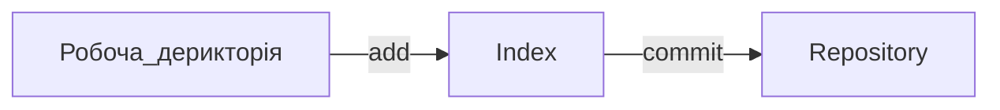

```git
...my_project> git init '#створюємо репозиторій'
```


#схема_1 

**`git add`** - додавання до дерикторії Index файлу/дерикторії 
`git commit` - додавання до Repository з дерикторії Index файлу/дерикторії
`git commit -m '.......'` - `-m` флаг для комміту з вводом коментаря невеликої довжини без виклика редактора коду, якщо коментар складається з одного слова `''` - непотрібні.
```git 
$ git status '#виводмо погляд зі сторони git на файли проекту'
>>>
On branch main
Untracked files: '#невідстежуюмі файли'
  (use "git add <file>..." to include in what will be committed)
        fon.html #файл невіомий git_у

$ git add fon.html '#добавляэмо в дерикторію Index(схема 1.)'

$ git status '#виводмо погляд зі сторони git на файли проекту в деректорію Index'
>>>
On branch main
Changes to be committed:
  (use "git restore --staged <file>..." to unstage)
        new file:   fon.html #файл проіндексований 
        
$ git commit '#переносимо з  деректорії Index до Repositiry' 
>>>
[main c65f6ac] 4 commit '#c65f6ac - хеш коміту'
 1 file changed, 0 insertions(+), 0 deletions(-)
 create mode 100644 fon.html

$ git status 
>>>
On branch main
nothing to commit, working tree clean '#деректорія Index = Repository'

```


