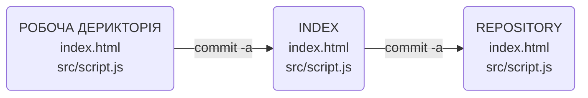

## Комміт конкретних змін в самому файлі 
Якщо ми редагуэмо файл index.html і в нас є декілька змін в ньому в вигляді рядка або блока, але ми хочемо зберегти лише один з них, а інші не чіпати, то слід використовувати наступну команду `git add -p name_file`:

```git
$ git add -p index.html
diff --git a/index.html b/index.html
index 93d9083..f91d547 100644
--- a/index.html
+++ b/index.html
@@ -6,9 +6,6 @@
        <title>My_new_site_2</title>
 </head>
 <body>
-       <header>
-               <meta charset="utf-8">
-       </header>
 <p>1 зміна</p>
 <p>2 зміна</p>
 <p>3 зміна</p>
(1/2) Stage this hunk [y,n,q,a,d,j,J,g,/,e,p,?]? y '#перша зміна. git запитує, чи добавляти його в дерикторію Index'
@@ -17,7 +14,5 @@
        <div>
                <p>Body</p>
        </div>
-
-
 </body>
 </html>
\ No newline at end of file
(2/2) Stage this hunk [y,n,q,a,d,K,g,/,e,p,?]? y '#друга зміна. git запитує, чи добавляти його в дерикторію Index'

```

## Комміти без git add

```git 
$ git status
'>>>'
Changes not staged for commit:
  (use "git add <file>..." to update what will be committed)
  (use "git restore <file>..." to discard changes in working directory)
        modified:   index.html '#перший непроіндексований файл'
        modified:   src/script.js '#едругий непроіндексований файл'


Kapitoha@HOME-PC MINGW64 /d/My_files/My_site (main)
$ git commit -am '8 commit' '#команда для "прямого" комміту в репозиторій Ropository'
[main a015356] 8 commit
 2 files changed, 11 insertions(+), 3 deletions(-)
```

Команда `git commit -a` - флаг `-a`  заставить команду `commit` перенести _всі_ непроіндексовані файли з Робочої_дерикторії, внести їх в Index, і одразу в Repository.



АЛЕ... `git commit -a` - не бачить файли які git не відстежує(неіндексовані попередньо). Створимо новий файл і не проіндексуємо його(new.html):
```git 
$ git status '#перевіряємо'
On branch main
Untracked files:
  (use "git add <file>..." to include in what will be committed)
        new.html '#непроіндексований файл'

nothing added to commit but untracked files present (use "git add" to track)

$ git commit -a '#коммітимо "напряму"'
On branch main
Untracked files:
  (use "git add <file>..." to include in what will be committed)
        new.html

nothing added to commit but untracked files present (use "git add" to track) '#нічого не відбулося, тому що файл попередньо непроіндексований'

```

Простими словами `git commit -a` - коммітить лише ті файли, які попередньо колись були проіндексовані в деректорію Index. Свіжо-створені файли, які жодного разу не індексувалися `git commit -a` - пропустить. 

## Коммітимо "напряму" конкретний файл/дерикторію

Припустмо у вас є зміни в кількох файлах, але вам потрібно терміново закомітити конкретно один:

```git 
$ git status '#перевіряємо'
On branch main
Changes to be committed:
  (use "git restore --staged <file>..." to unstage)
        modified:   index.html

Changes not staged for commit:
  (use "git add <file>..." to update what will be committed)
  (use "git restore <file>..." to discard changes in working directory)
        modified:   .gitignore '#потрібно закомітити конкретно це файл'
        modified:   src/script.js

```

Вводимо команду `git commit -m '....' .file.name`(можна прописувати файл/деректорію).

```git 
$ git commit -m '.gitignore_commit' .gitignore
[main 3e0853d] .gitignore_commit
 1 file changed, 1 insertion(+) '#все, закомітиний конкретно цей файл'
```

Команда `git commit -m '....' .file.name` бере вказаний вами файл(застявляємо його працювати по вказаному шляху) переміщає його з Робочої_деректорії в Index, а звідти одразу в Repository.


```git 
$ git status '#знову перевіряємо'
On branch main
Changes to be committed:
  (use "git restore --staged <file>..." to unstage)
        modified:   index.html

Changes not staged for commit:
  (use "git add <file>..." to update what will be committed)
  (use "git restore <file>..." to discard changes in working directory)
        modified:   src/script.js
'#потрібний нам файл зкоммічено. Всі попередні зміни залишилися на своїх місцях'
```

**АЛЕ** ця команда має таку саму проблему як флаг `-a`, він коммітить лише **_попередньо проіндексовані файли**_. 
## Міні - підсумок
- `-a` - для **ВСІХ**  змін, але тільки в попередньо проіндексованих файлах: `git commit -a`
- `git commit ...\file_name` - для комміту по конкретно вказаному шляху, але будуть коммітитися  лише **_попередньо проіндексовані файли**_
Чому це так ? Це зроблено спеціально, щоб в головний репозиторій не попало щось лишнє, якийсь тимчасовий файл і тд. 

Якщо ж хочеться просто закоммітити без попереднього індексування...звісно такої команди не існує, але використати `alias`, наприклад ось такий:

- `git config --global alias.commitall '!git add .;git commit` - `git add .` додає в індекс конкретно всю відкриту деректорію, а `git commit` переносить всі файли з Index в Repository.
Або другий варіант: 
- `git config --global alias.commitall '!git add -A;git commit` -  флаг `-A`, з якої б деректорії ти його не визвав, від добавить в Index взагалі всі зміни починаючи з корня проекту. Але так робити дуже не рекомендується, тому що це один велечезний недеталізований коміт. Керуємося правилом "Хорошого комміту".
